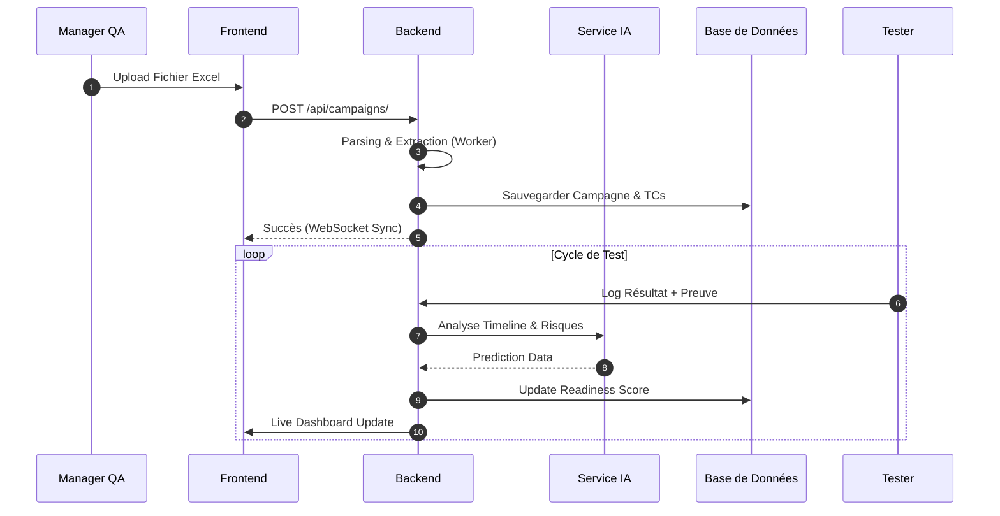
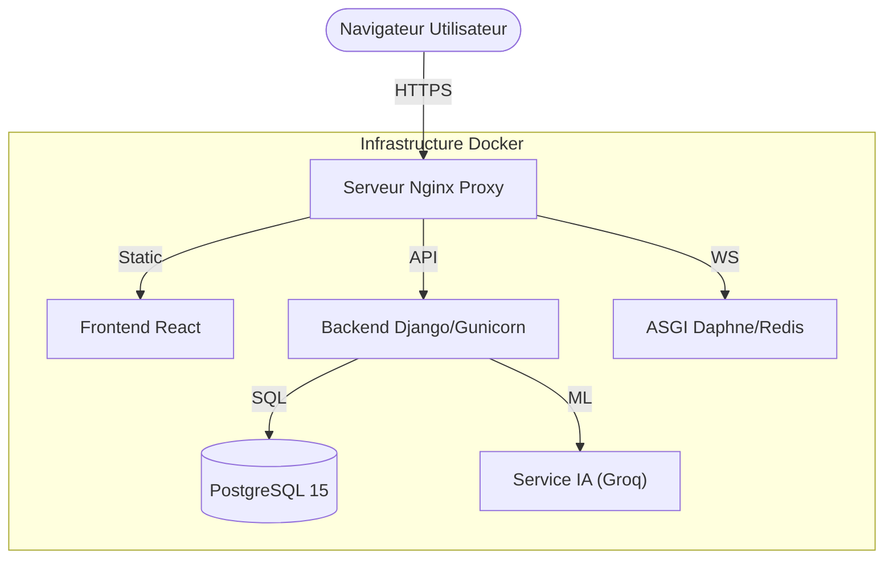

# Architecture Technique de la Plateforme InsureTM (v2.0)

Cette documentation centralise les diagrammes v2.0, synchronisés avec le code source et structurés selon les standards académiques d'un Projet de Fin d'Études (PFE).

## 1. Diagramme de Classes (Modélisation des Données)

Ce diagramme présente la structure exhaustive des entités métier, incluant les énumérations et les relations de multiplicité.

```mermaid
classDiagram
    class User {
        -id: int
        -username: string
        -email: string
        -role: RoleType
        -is_active: bool
        -date_joined: datetime
        +save()
        +generate_random_password()
    }

    class Projets {
        -id: int
        -name: string
        -description: string
        -created_at: datetime
    }

    class Release {
        -id: int
        -name: string
        -status: StatutRelease
        -release_type: TypeRelease
        -score_readiness: float
        +calculerReadiness()
    }

    class Campagne {
        -id: int
        -titre: string
        -nb_cas_de_test: int
        +obtenirProgression()
    }

    class Message {
        -id: int
        -contenu: text
        -piece_jointe: file
        -est_modifie: bool
        -date_envoi: datetime
    }

    class Mail {
        -id: int
        -texte: text
        -piece_jointe: file
        -date_creation: datetime
        -date_modification: datetime
    }

    class TaskAssignment {
        -test_case_ref: string
        -assigned_at: datetime
        -is_completed: boolean
    }

    class CasDeTest {
        -id: int
        -reference_tc: string
        -donnees_json: json
        -statut: StatutTest
        -date_execution: datetime
        -fichier_preuve: file
    }

    class RapportReadiness {
        -id: int
        -score_total: float
        -score_tests: float
        -score_anomalies: float
        -score_stabilite: float
        -score_securite: float
        -recommandations: list
    }

    class Anomalie {
        -id: int
        -titre: string
        -description: string
        -impact: ImpactAnomalie
        -priorite: PrioriteAnomalie
        -visibilite: Choice {PUBLIQUE, PRIVEE}
        -statut: StatutAnomalie
        -preuve_image: file
        -cree_le: datetime
    }

    class ConversationIA {
        -id: uuid
        -titre: string
        -cree_le: datetime
    }

    class MessageIA {
        -id: int
        -expediteur: string
        -texte: text
        -type_contenu: string
    }

    Projets "1" *-- "0..*" Release : contenir
    Release "1" *-- "0..*" Campagne : planifier
    Campagne "1" *-- "0..*" CasDeTest : composer
    Release "1" -- "0..1" RapportReadiness : évaluer
    CasDeTest "1" *-- "0..*" Anomalie : générer
    User "1" -- "0..*" Projets : être propriétaire de
    Testeur "1" -- "0..*" CasDeTest : exécuter
    (Testeur, Campagne) .. TaskAssignment
    User "1" -- "0..*" Mail : envoyer / recevoir
    User "1" -- "0..*" ConversationIA : interagir avec
    ConversationIA "1" *-- "0..*" MessageIA : contenir
```

## 2. Diagramme des Cas d'Utilisation (Interactions Acteurs)

Représente les services offerts par la plateforme aux différents acteurs (Administrateurs, Managers, Testeurs).

```mermaid
useCaseDiagram
    actor Admin as "Administrateur"
    actor Manager as "Manager QA"
    actor Tester as "Testeur"
    
    package "Plateforme InsureTM" {
        usecase UC1 as "Gérer Portefeuille Business"
        usecase UC2 as "Planifier Releases & Gantt"
        usecase UC3 as "Importer Campagnes Excel"
        usecase UC4 as "Exécuter Tests & Preuves"
        usecase UC5 as "Gérer les Anomalies"
        usecase UC6 as "Analyser Readiness (IA)"
        usecase UC7 as "Communiquer (Chat/Mail)"
        usecase UC8 as "Conversation IA (Chat Agent)"
    }

    Admin --> UC1
    Manager --> UC2
    Manager --> UC3
    Manager --> UC6
    Manager --> UC7
    Manager --> UC8
    Tester --> UC4
    Tester --> UC5
    Tester --> UC7
    
    UC3 ..> UC4 : <<include>>
    UC4 ..> UC5 : <<extend>>
```

## 3. Diagramme de Séquence Global (Workflow Nominal)

Décrit le flux de travail de la planification à l'analyse analytique.



## 4. Architecture Physique (Déploiement)


